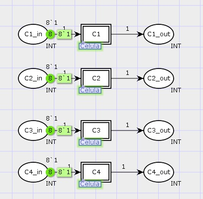
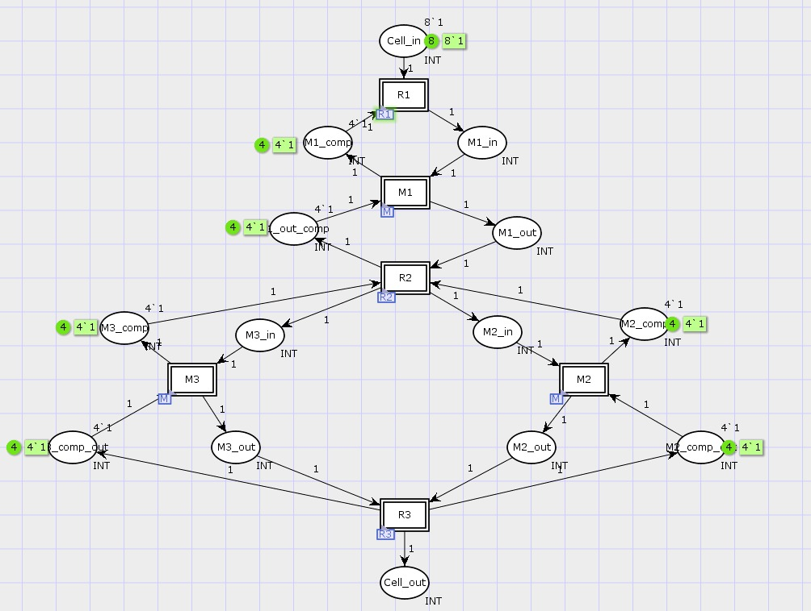
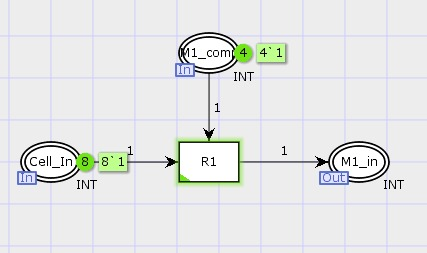
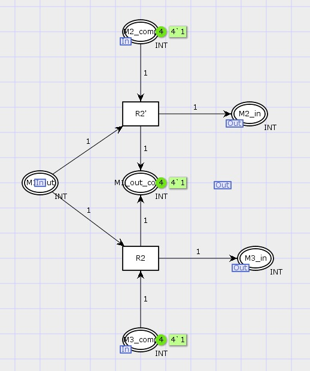
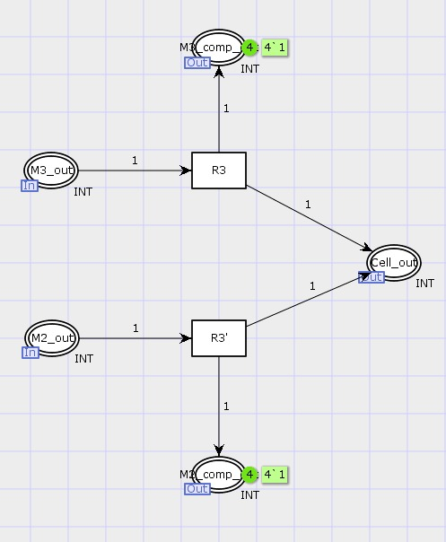
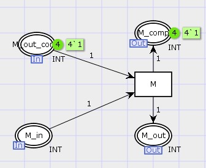

# Projeto 2 - Sistema de Manufatura com Redes de Petri Coloridas

Este projeto consiste na modelagem de um sistema de manufatura com quatro células utilizando **Redes de Petri Coloridas (CPN)**, desenvolvido como parte da disciplina **Sistemas a Eventos Discretos (SED)** no período 2024.2 da **UFCG**.

---

## Descrição do Sistema

Cada célula de manufatura é composta por:

-  Um depósito de entrada  
-  Um depósito de saída  
-  Três máquinas (M1, M2, M3), cada uma com:
  - Um depósito de entrada
  - Um depósito de saída  
-  Três robôs responsáveis pelo transporte de itens

### Fluxo de Produção

- **Robô 1**: transporte do depósito de entrada da célula para o depósito de entrada da Máquina 1  
- **Robô 2**: transporte da saída da Máquina 1 para as entradas das Máquinas 2 ou 3  
- **Robô 3**: transporte das saídas das Máquinas 2 ou 3 para o depósito de saída da célula  

> Cada depósito pode conter no máximo **4 itens**, e o sistema deve funcionar **sem bloqueios (deadlocks)**.

---

## Objetivo

Modelar um sistema com 4 células de manufatura interligadas, garantindo funcionamento contínuo, sincronizado e sem bloqueios, utilizando **CPN Tools** para simulação e análise.

---
## Modelagem no CPN Tools

A modelagem desenvolvida no CPN Tools representa detalhadamente o funcionamento interno de uma célula de manufatura automatizada, composta por três máquinas e três robôs. A Manufatura que modelamos contém um depósito de entrada, três máquinas (M1, M2 e M3), três robôs e um depósito de saída. Os robôs são responsáveis por mover as peças entre as máquinas, e cada depósito só pode armazenar no máximo 4 fichas.

O fluxo do sistema funciona da seguinte forma: o Robô 1 leva uma ficha do depósito de entrada até a Máquina 1. A M1 processa essa ficha e a envia para o Robô 2, que pode levá-la até a Máquina 2 ou 3. Após esse segundo processamento, o Robô 3 leva a ficha final até o depósito de saída da célula.

Para garantir que o sistema funcione corretamente e não ultrapasse o limite de 4 fichas por depósito, usamos o que chamamos de complementares. Eles representam o espaço disponível em cada depósito. Por exemplo, se o depósito da M1 tiver 3 fichas, o complementar terá apenas 1. Se tentar entrar mais uma ficha sem espaço, o sistema não permite — isso evita travamentos e bloqueios.

A modelagem foi feita dividindo os blocos em: robôs, máquinas e o sistema geral. Cada máquina tem um depósito de entrada, uma transição que representa o processamento, e um depósito de saída. Os robôs conectam essas etapas com controle baseado nos complementares. Reaproveitamos a estrutura das máquinas para as três etapas, o que deixou o modelo modular e organizado. No final, todas essas partes foram integradas em uma célula completa.


### Manufatura

Manufatura, representando o maior nível de hierarquia do sistema, contendo sub-blocos de cada célula. 



### Célula

Célula, segundo maior nível de hierarquia, cada célula contém três máquinas e três robôs.



### Robô 1

Este módulo representa o transporte dos itens do **depósito de entrada da célula** para o **depósito de entrada da Máquina 1**. 



### Robô 2

Responsável por transferir os itens da **saída da Máquina 1** para os depósitos de entrada das **Máquinas 2 e 3**.  



### Robô 3

Encaminha os itens da **saída das Máquinas 2 e 3** para o **depósito de saída da célula**.  



---

### Máquinas

A modelagem das máquinas foi feita utilizando uma estrutura genérica reaproveitável. A mesma lógica foi aplicada às três máquinas, com ajustes apenas nas rotas de entrada e saída. 



---
## Tecnologias Utilizadas

- [CPN Tools](https://cpntools.org/) – Edição, simulação e análise de Redes de Petri Coloridas  
- [Java (Oracle)](https://www.java.com/pt-BR/) – Necessário para execução do CPN Tools

---

## Estrutura do Repositório

```
📁 modelo/
   └── robos_manufatura.cpn      # Arquivo principal do modelo CPN
📁 imagens/
   └── Máquinas.jpeg            # Ilustrações
   └── R1.jpeg
   └── R2.jpeg
   └── R3.jpeg
   └── sistema.jpeg
📄 README.md                         # Documentação (este arquivo)


```

## Demonstração em Vídeo

Assista à explicação e simulação do modelo no YouTube:  
[Clique aqui para ver o vídeo](https://youtu.be/cIlXSo69eLA)


---

## Como Executar o Modelo

1. Instale o [CPN Tools](https://cpntools.org/)
2. Instale o [Java (Oracle)](https://www.java.com/pt-BR/)
3. Baixe este repositório e abra o arquivo `.cpnet` na pasta `modelo/`
4. Use o CPN Tools para simular o funcionamento do sistema de manufatura

---

## Integrantes do Grupo

- Gabrielle Pereira  
- Sarah Borba
- Victor Gomes
